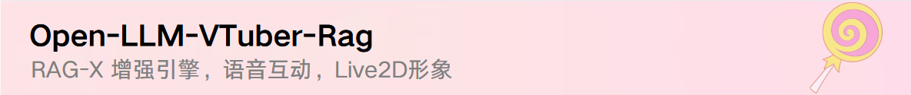
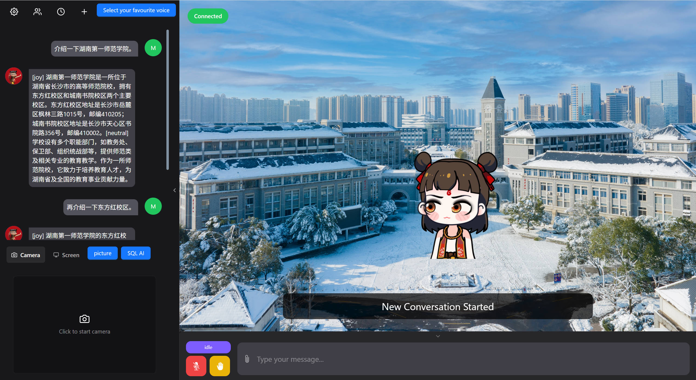

<h1 align="center">Open-LLM-VTuber-Rag</h1>
<h3 align="center"></h3>

## ⭐️ 项目简介

**Open-LLM-VTuber-Rag** 是基于**检索增强生成（RAG）技术**的独特的**语音交互 AI **，它不仅支持**实时语音对话**和**视觉感知**，还配备了生动的 **Live2D 形象**。

**检索增强生成（RAG）**：结合实时检索与深度学习生成能力，使 AI 回答更加精准、上下文连贯，并具备知识更新能力。

**实时语音对话**：支持高质量的语音识别与合成，提供流畅自然的语音交互体验。              

**视觉感知**：通过摄像头或虚拟输入，AI 能够识别人脸表情、手势、物体等信息，以增强互动性。

**Live2D 虚拟形象**：支持高自由度的 Live2D 形象定制，能根据语音和情感反馈进行动态表现，使 AI 形象更加生动。

## 👀 效果演示

|  |
| ---------------------- |

## ✨ 功能和亮点

- **🔗 万物皆可上下文**：可以将任何文档、资源（如网址链接、音频、视频）或内容片段转换为上下文，以便任何大语言模型（LLM）在聊天期间作为参考使用。
- **🏗️ 智能工作区架构**：文档划分为称为`workspaces` (工作区)的对象。工作区的功能类似于线程，同时增加了文档的容器化。工作区可以共享文档，但工作区之间的内容不会互相干扰或污染，因此您可以保持每个工作区的上下文清晰。

- 🖥️ **跨平台支持**：完美支持 macOS、Linux 和 Windows。我们支持英伟达和非英伟达 GPU，可以选择在 CPU 上运行或使用云 API 处理资源密集型任务。部分组件在 macOS 上支持 GPU 加速。

- 🔒 **支持离线模式**：使用本地模型完全离线运行 - 无需联网。你的对话只会待在你的设备上，确保隐私安全。

- 💻 **好看且功能强大的网页和桌面客户端**：提供网页版和桌面客户端两种使用方式，支持丰富的交互功能和个性化设置，桌面客户端还可以在窗口模式和桌宠模式之间自由切换，让 AI 伴侣随时陪伴在身边

- 🎯 **高级交互功能**：
  - 👁️ 视觉感知，支持摄像头、屏幕录制和截图，让 AI 伙伴能看到你和你的屏幕
  - 🎤 语音打断，无需耳机（AI 不会听到自己的声音）
  - 🫱 触摸反馈，可以通过点击或拖拽与 AI 伙伴互动
  - 😊 Live2D 表情，设置情绪映射让后端控制模型表情
  - 🐱 宠物模式，支持透明背景全局置顶和鼠标穿透 - 可以将你的 AI 伙伴拖到屏幕上的任意位置
  - 🗣️ AI 主动说话功能
  - 💭 AI 内心 OS，AI 的表情、想法和动作可以被看到，但不会被读出来
  - 💾 聊天记录持久化，可以随时切换到以前的对话
  - 🌍 TTS 翻译支持（例如，用中文聊天的同时，AI 使用日语声音）

- 🧠 **广泛的模型支持**：
  - 🤖 大语言模型 (LLM)：Ollama、OpenAI（以及任何与 OpenAI 兼容的 API）、Gemini、Claude、Mistral、DeepSeek、智谱、GGUF、LM Studio、vLLM 等
  - 🎙️ 语音识别 (ASR)：sherpa-onnx、FunASR、Faster-Whisper、Whisper.cpp、Whisper、Groq Whisper、Azure ASR等
  - 🔊 语音合成 (TTS)：sherpa-onnx、pyttsx3、MeloTTS、Coqui-TTS、GPTSoVITS、Bark、CosyVoice、Edge TTS、Fish Audio、Azure TTS等

- 🔧 **高度可定制**:
  - ⚙️ **简单的模块配置**：通过简单的配置文件修改，即可切换各种功能模块，无需深入代码
  - 🎨 **角色随心定制**：导入自定义 Live2D 模型，让你的 AI 伴侣拥有独特外观。通过修改 Prompt，塑造你 AI 伴侣的人设。进行音色克隆，让你的 AI 伴侣有着你想要的声线
  - 🧩 **Agent自由实现**：继承并实现 Agent 接口，接入任何架构的 Agent，如 HumeAI EVI、OpenAI Her、Mem0 等
  - 🔌 **良好的可扩展性**：模块化设计让你能轻松添加自己的 LLM、ASR、TTS 等模块实现，随时扩展新特性

